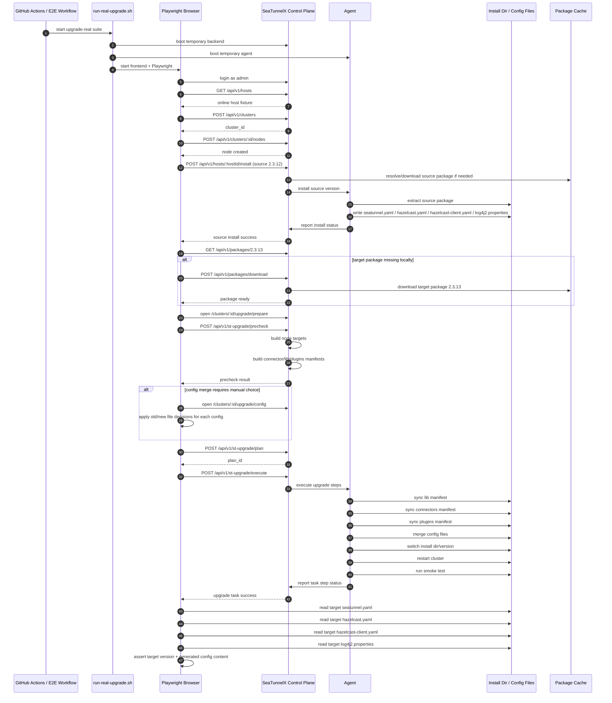

# Upgrade Real E2E Flow

## Purpose

This document captures the real end-to-end upgrade verification flow added for `upgrade-real`.
It is intended to explain:

- what the test actually provisions
- which control-plane and agent APIs are exercised
- which upgrade behaviors are verified
- how incremental CI decides whether to run the suite

## Scope

The `upgrade-real` suite verifies a **real single-node SeaTunnel cluster upgrade**:

- source version: `2.3.12`
- target version: `2.3.13`
- package source: online download
- execution path: Playwright -> Control Plane -> Agent -> SeaTunnel install dir
- final validation: real generated files on disk

## Sequence Diagram

## What the test verifies

### 1. Source cluster creation is real

The suite does **not** mock an upgraded cluster.
It really:

- creates a cluster record
- adds a node
- installs source version `2.3.12`
- waits for host install success

### 2. Target package preparation is real

Before upgrade execution, the suite ensures target package `2.3.13` exists locally.
If absent, it triggers package download through the normal package API.

### 3. Upgrade prepare/config/execute pages are real

The browser goes through:

- `/clusters/:id/upgrade/prepare`
- `/clusters/:id/upgrade/config`
- `/clusters/:id/upgrade/execute`

No page-level mocks are used for the core upgrade flow.

### 4. Upgrade execution is real

The suite waits for a successful upgrade task and requires the expected step chain to appear, including:

- `SWITCH_VERSION`
- `START_CLUSTER`
- `HEALTH_CHECK`
- `SMOKE_TEST`
- `COMPLETE`

### 5. Final file assertions are real

After upgrade succeeds, the test reads the actual target install dir and asserts key content in:

- `config/seatunnel.yaml`
- `config/hazelcast.yaml`
- `config/hazelcast-client.yaml`
- `config/log4j2.properties`

## Config assertions currently covered

### seatunnel.yaml

The suite verifies target runtime config such as:

- HTTP enabled
- HTTP port migrated correctly
- checkpoint namespace retained
- `fs.defaultFS: file:///`

### hazelcast.yaml

The suite verifies IMAP state for the test scenario (currently disabled for this flow).

### hazelcast-client.yaml

The suite verifies cluster members are written using the **real online host IP** and target Hazelcast port.

### log4j2.properties

The suite verifies the expected log mode mapping after upgrade.

## Incremental CI trigger design

`upgrade-real` should run only when relevant upgrade/install/config paths change.

Current trigger buckets include:

- `internal/apps/stupgrade/**`
- `internal/apps/plugin/**`
- `internal/apps/config/**`
- `internal/apps/cluster/**`
- `internal/seatunnel/**`
- `agent/internal/installer/**`
- `frontend/components/common/cluster/upgrade/**`
- `frontend/e2e/upgrade-real.spec.ts`
- `frontend/e2e/helpers/upgrade-real.ts`
- `frontend/scripts/e2e/run-real-upgrade.sh`
- `frontend/scripts/e2e/run-real-installer.sh`
- `config.e2e.installer-real.yaml`
- `config.e2e.agent-real.yaml`

This keeps the suite:

- **enabled in remote CI**
- **incremental for pull requests**
- isolated from ordinary smoke selection

## Resource notes

### CI

In GitHub Actions, this suite is allowed to create and discard temporary resources because the runner is ephemeral.
Local destructive cleanup is intentionally not required for CI success.

### Local development

This suite is heavy for small machines.
For low-memory environments, the preferred mode is:

- let remote CI run it
- avoid repeated local execution unless actively debugging the flow

## Known maintenance rules

1. Do not commit downloaded package cache under `frontend/lib/packages/`.
2. Keep `upgrade-real` excluded from ordinary smoke selection.
3. Always assert `hazelcast-client.yaml` using the real resolved host IP, not a hard-coded loopback value.
4. If config merge introduces conflicts, the suite must explicitly resolve them before creating an upgrade plan.
