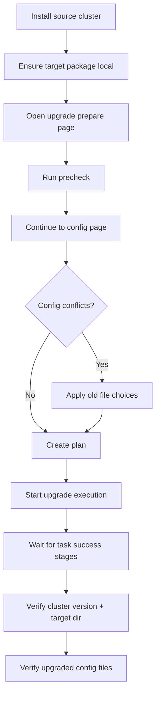
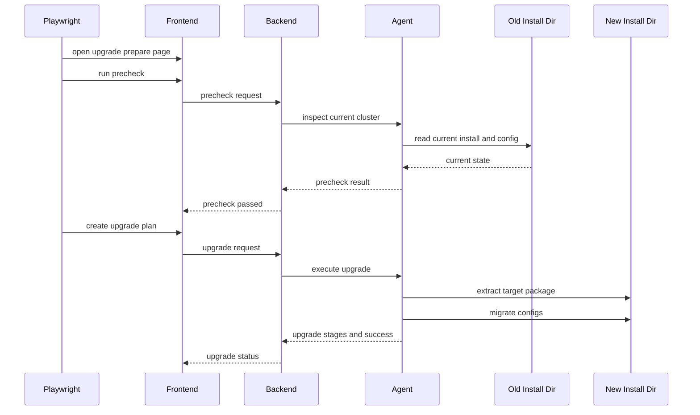

<!--
Licensed to the Apache Software Foundation (ASF) under one or more
contributor license agreements.  See the NOTICE file distributed with
this work for additional information regarding copyright ownership.
The ASF licenses this file to You under the Apache License, Version 2.0
(the "License"); you may not use this file except in compliance with
the License.  You may obtain a copy of the License at

  http://www.apache.org/licenses/LICENSE-2.0

Unless required by applicable law or agreed to in writing, software
distributed under the License is distributed on an "AS IS" BASIS,
WITHOUT WARRANTIES OR CONDITIONS OF ANY KIND, either express or implied.
See the License for the specific language governing permissions and
limitations under the License.
-->

# Real Upgrade Scenario

Spec:

- `frontend/e2e/upgrade-real.spec.ts`

## Entry command

```bash
cd frontend
pnpm exec bash ./scripts/e2e/run-real-upgrade.sh
```

## Shared real-runner logic

All real suites reuse the same real-install harness.

### What the harness prepares

`scripts/e2e/run-real-installer.sh`:

1. creates a temporary working directory under `tmp/e2e/installer-real.*`
2. generates temporary backend and agent config files
3. starts a temporary MinIO container when needed
4. creates checkpoint and IMAP buckets for MinIO-backed flows when needed
5. ensures `seatunnelx-java-proxy` jar is available for post-install checks
6. starts:
   - temporary backend
   - temporary agent supervisor
   - frontend dev server
7. runs the selected Playwright spec


## Covered behaviors

- install a real source cluster on the old version
- ensure the target package exists locally
- open upgrade prepare page
- run precheck
- continue to upgrade config
- optionally resolve config conflicts by choosing old files
- create upgrade plan
- execute upgrade
- wait for key upgrade task stages
- verify upgraded cluster version and target install dir
- verify generated config files after upgrade

## Execution flow



## Sequence



