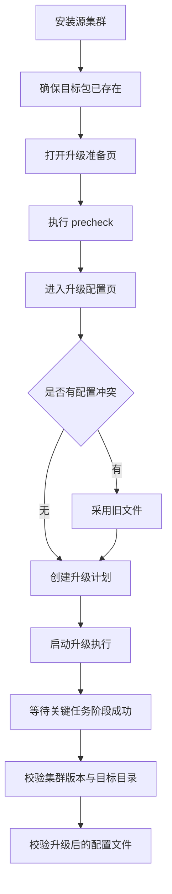
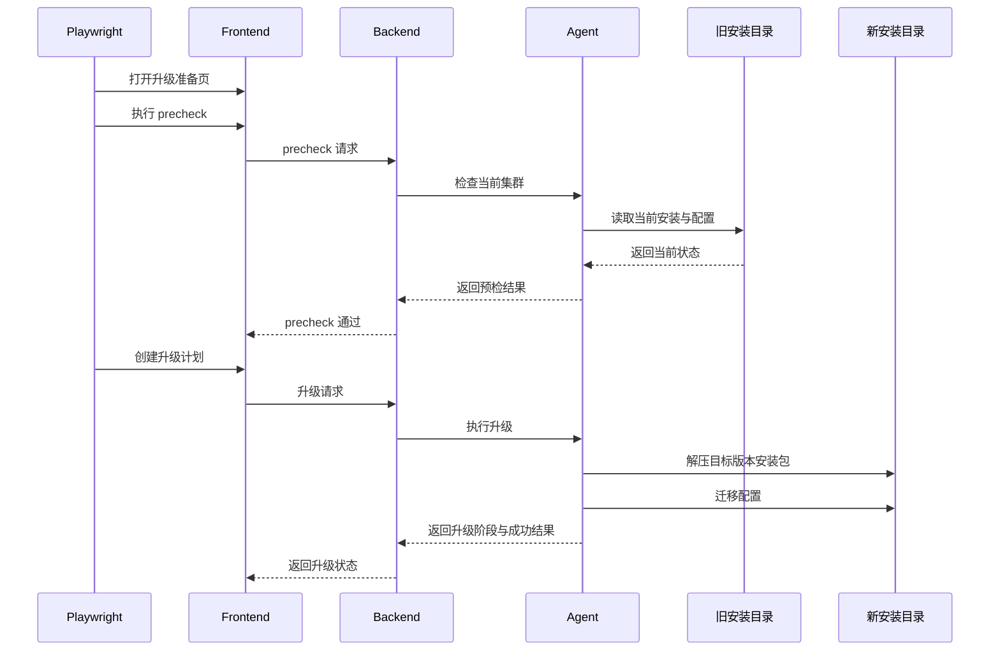

<!--
Licensed to the Apache Software Foundation (ASF) under one or more
contributor license agreements.  See the NOTICE file distributed with
this work for additional information regarding copyright ownership.
The ASF licenses this file to You under the Apache License, Version 2.0
(the "License"); you may not use this file except in compliance with
the License.  You may obtain a copy of the License at

  http://www.apache.org/licenses/LICENSE-2.0

Unless required by applicable law or agreed to in writing, software
distributed under the License is distributed on an "AS IS" BASIS,
WITHOUT WARRANTIES OR CONDITIONS OF ANY KIND, either express or implied.
See the License for the specific language governing permissions and
limitations under the License.
-->

# 升级 Real 场景说明

Spec：

- `frontend/e2e/upgrade-real.spec.ts`

## 入口命令

```bash
cd frontend
pnpm exec bash ./scripts/e2e/run-real-upgrade.sh
```

## 共享 real-runner 逻辑

所有 real 场景都复用了同一套 real-install 执行骨架。

### `run-real-installer.sh` 会做什么

`scripts/e2e/run-real-installer.sh` 会：

1. 在 `tmp/e2e/installer-real.*` 下创建临时工作目录
2. 生成临时 backend / agent 配置
3. 按需启动临时 MinIO
4. 在需要 MinIO 的场景下创建 checkpoint / IMAP bucket
5. 确保 `seatunnelx-java-proxy` jar 可用于安装后校验
6. 启动：
   - 临时 backend
   - 临时 agent supervisor
   - frontend dev server
7. 执行指定的 Playwright spec


## 当前覆盖内容

- 安装旧版本真实集群
- 确保目标版本安装包已在本地可用
- 打开升级准备页
- 执行 precheck
- 进入升级配置页
- 如有冲突，按规则采用旧文件
- 创建升级计划
- 执行升级
- 等待关键升级阶段成功
- 校验升级后的版本与目标安装目录
- 校验升级后的配置文件

## 执行流程图



## 时序图



